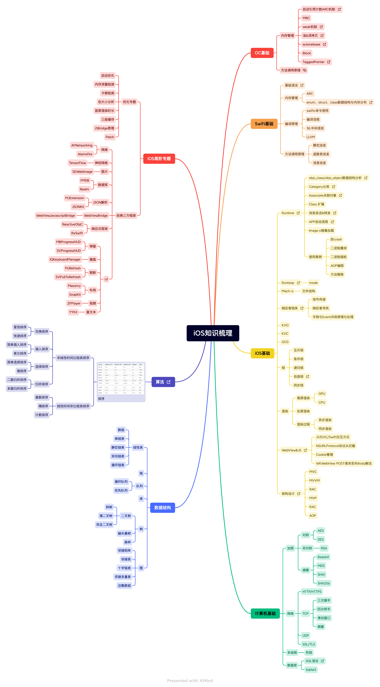

# iOS-knowledge（未完待续...）
> 从事iOS工作已经有好几年了，学习了很多相关技术，也见识了很多。
> 
> 这个仓库根据我的设想，远远没有完善，后续需要不断迭代更新，本仓库的知识梳理总脑图不会展开太多细节。
> 
> 欢迎大家提PR，一起完善。

## 知识脑图

## 推荐书籍
- 《Effective Objective-C 2.0》
- 《Objective-C 高级编程》
- 《图解HTTP》
- 《剑指Offer》
